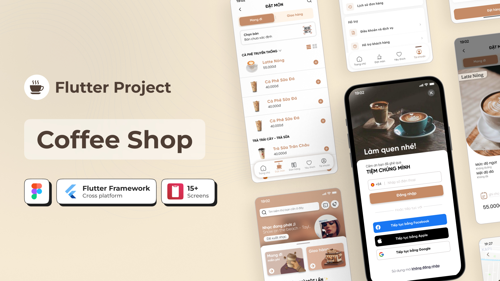
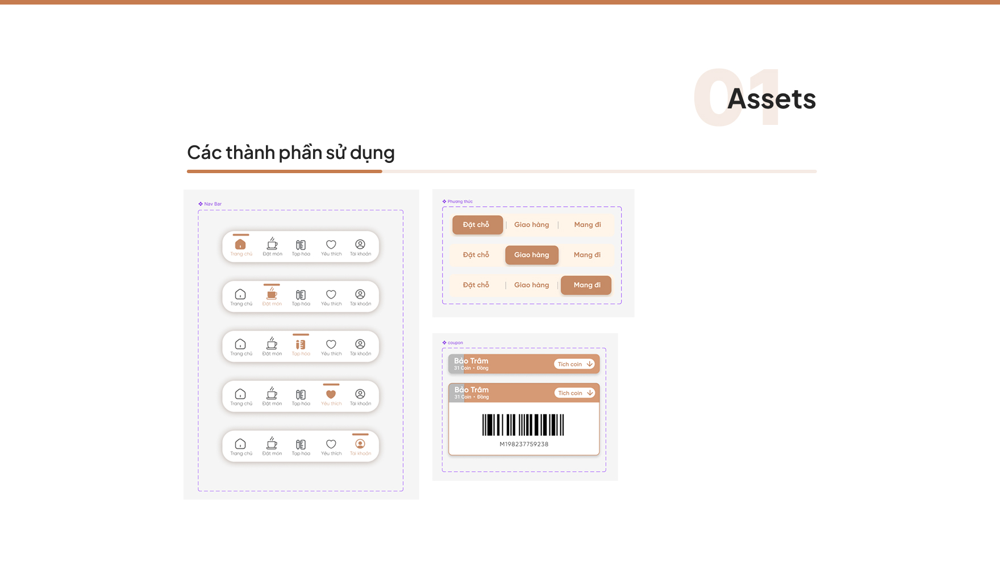
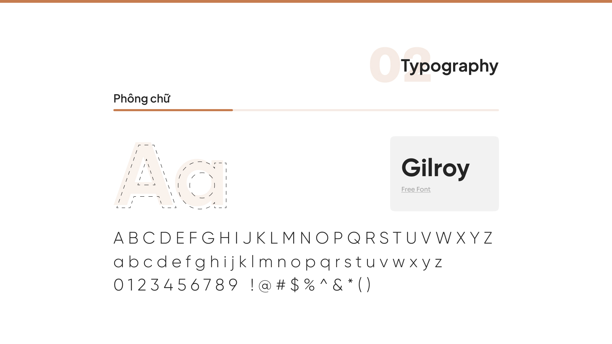
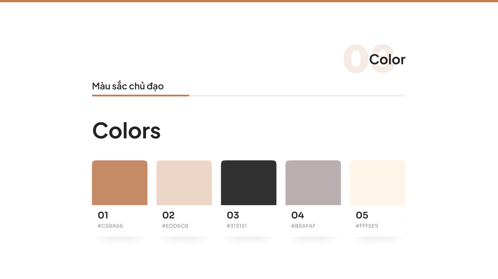
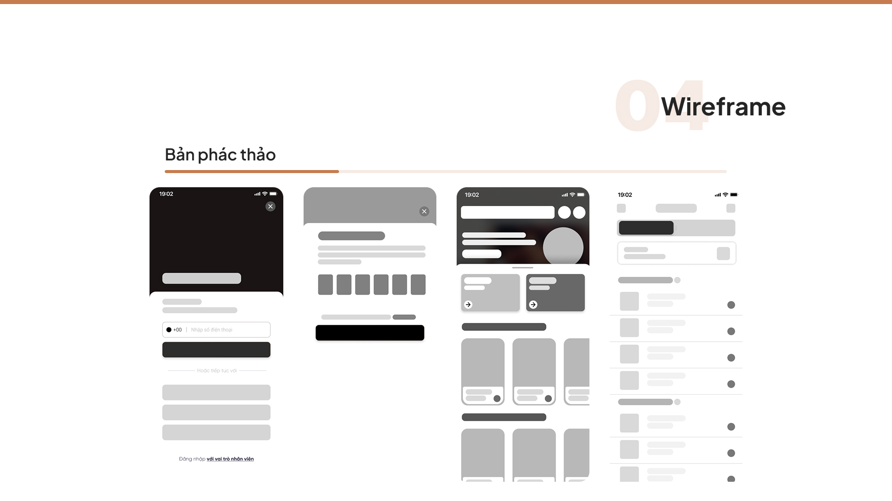
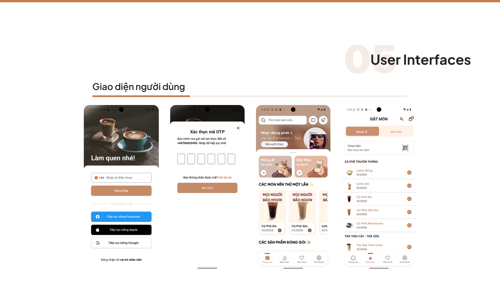
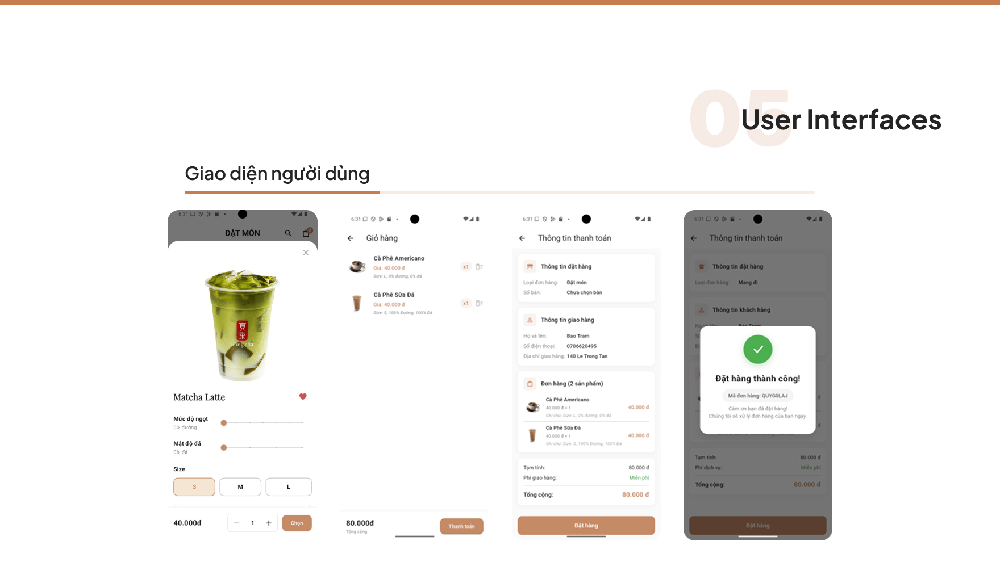

# coffee_application
This is a **Coffee Shop Management App** built with **Flutter**. The app uses **Firebase Authentication** for user login and **Firestore** to store and manage data in real time.  

- Customers can browse the menu, place orders, and track their order status.
- Staff can manage and update orders efficiently.

## App Showcase / Overview

⚠️ *This project is for study purposes only.*
